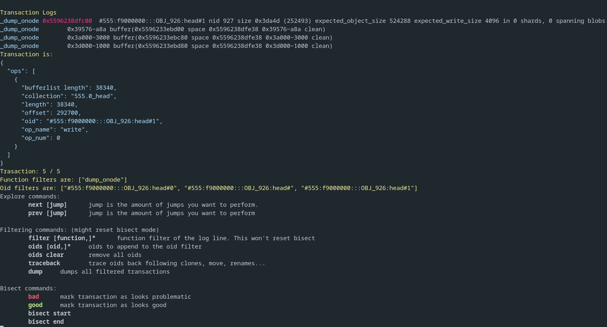

# Bluestore's log biscect tool 

only works on bluestore tests and with log level 30 for now.
## Commands
`cargo run explore example.log`

**Explore commands**:

        next [jump]      jump is the amount of jumps you want to perform.

        prev [jump]      jump is the amount of jumps you want to perform

**Filtering commands**: (might reset bisect mode)

        filter [function,]*      function filter of the log line. This won't reset bisect

        oids [oid,]*     oids to append to the oid filter

        oids clear       remove all oids

        traceback        trace oids back following clones, move, renames...

        dump     dumps all filtered transactions

**Bisect commands**:

        bad      mark transaction as looks problematic

        good     mark transaction as looks good

        bisect start

        bisect end


## Workflow example:
**0**
run the utility on the bluestore log
`cargo run example.log`

```
Trasaction: 1182 / 1182
Function filters are: []
Oid filters are: []
```

**1**
`oids #555:f9000000:::OBJ_926:head#1`

```
Trasaction: 2 / 2
Function filters are: []
Oid filters are: ["#555:f9000000:::OBJ_926:head#1"]
```

**2**
`traceback`

Traceback fills oid filters with oids related to the first node. Related means that the object was cloned or moved from another one.

```
Trasaction: 5 / 5
Function filters are: []
Oid filters are: ["#555:f9000000:::OBJ_926:head#", "#555:f9000000:::OBJ_926:head#0", "#555:f9000000:::OBJ_926:head#1"]
```

**3**
`bisect start`

This will start a binary search of transactions on the current filter.
```
Trasaction: 3 / 5
Function filters are: []
Oid filters are: ["#555:f9000000:::OBJ_926:head#", "#555:f9000000:::OBJ_926:head#0", "#555:f9000000:::OBJ_926:head#1"]
```


**4**
`filter dump_onode,dump_extent_map`
narrow down the logs displayed


