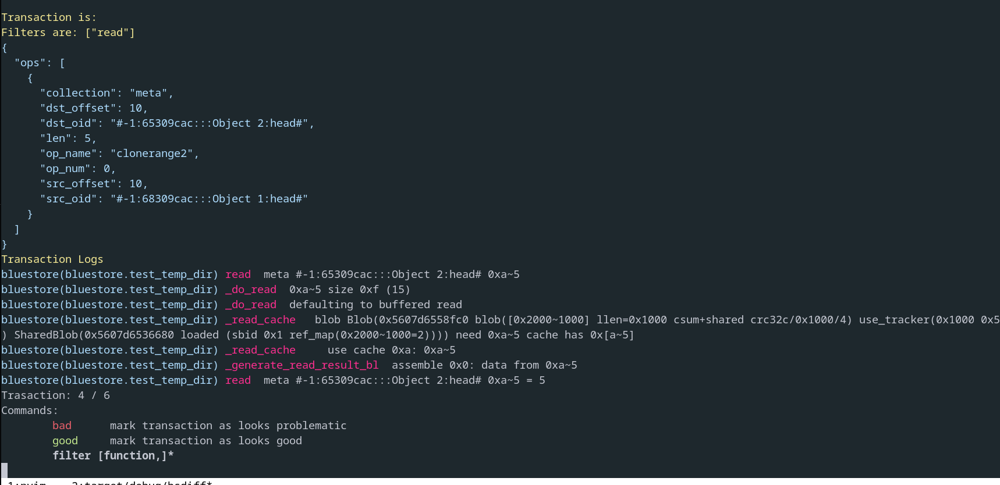

# Bluestore's log biscect tool 

Exploring with `cargo run explore example.log`. Jump between transactions.

Bisect with  `cargo run bisect example.log`. Find an issue.

Filtering logs by function:

`filter dump_onode,dump_extent_map`

